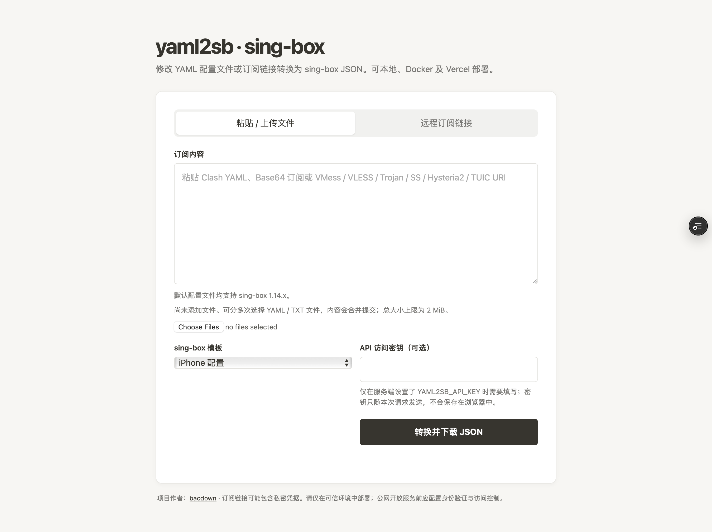

# yaml2sb

将 Clash YAML、Base64 订阅或常见代理 URI 转换为 sing-box JSON。提供本地网页版、Docker、Vercel、Cloudflare Workers 与命令行用法。

## 许可证

本项目采用 [MIT License](LICENSE)。

## 项目 Wiki

请前往 [GitHub Wiki](https://github.com/bacdown/yaml2sb/wiki) 查看使用说明。

## 支持范围

- Clash YAML 中的 `proxies` 节点
- 明文或 Base64 编码的订阅
- URI：`vmess://`、`vless://`、`trojan://`、`ss://`、`hysteria2://` / `hy2://`、`hysteria://`、`tuic://`、`anytls://`
- Clash 节点类型：Shadowsocks（含 obfs / v2ray-plugin / shadow-tls 插件）、VMess、VLESS（含 Reality）、Trojan、Hysteria2、Hysteria v1、TUIC、AnyTLS、HTTP、SOCKS5
- Hysteria2：端口跳跃（`ports` / `mport`）、带宽、`alpn: h3`、`disable_chrome_parrot`（兼容 sing-box 1.14+ Ed25519 证书节点）
- 将解析出的节点并入 sing-box JSON 模板中的策略组

不支持的节点会被跳过；如果没有解析到任何可用节点，转换会报错。

### 近期优化要点

- 修复 Clash `fingerprint` 误当作 uTLS 客户端指纹的问题（证书 SHA256 钉扎不再写入 `tls.utls`）
- Hysteria2 / TUIC 默认补充 `alpn: ["h3"]`，Hysteria2 默认 `disable_chrome_parrot: true`
- Shadowsocks 插件与 HTTP / SOCKS5 / AnyTLS / Hysteria v1 支持
- 协议转换改为注册表结构，便于扩展；增加 `test_convert.py` 单元测试
- 支持 `GET /sub` 远程订阅转换；可部署到 Vercel 与 Cloudflare Workers

## 网页版部署向导

按目标选择一种方式即可；都提供浏览器转换界面（粘贴订阅 / 远程链接、选平台模板、下载 JSON）。

| 方式 | 适合谁 | 是否免费额度 | 部署难度 |
|------|--------|--------------|----------|
| **Vercel** | 想尽快上线公网网页 + API | 有免费额度 | 低（推荐） |
| **Cloudflare Workers** | 已有 CF 账号，要边缘节点 + `/sub` 订阅 | 有免费额度 | 中 |
| **Docker / 本机** | 私有化、旁路由、内网 | 自备机器 | 低 |

### 向导 A：Vercel（推荐，约 5 分钟）

1. 将本项目推送到 GitHub（公开或私有仓库均可）。
2. 打开 [Vercel](https://vercel.com/) → **Add New → Project** → 导入该仓库。
3. **Root Directory** 选项目根目录；框架选 **Other**（或保持自动检测）。
4. **不要**填写特殊 Build / Output；依赖由 `requirements.txt` / `pyproject.toml` 中的 PyYAML 自动安装。
5. 点击 **Deploy**。完成后打开：
   - 网页：`https://<项目名>.vercel.app/`
   - API：`https://<项目名>.vercel.app/api`
   - 远程订阅：`https://<项目名>.vercel.app/sub?url=<编码后的原订阅>&template=phone`
6. （可选）在 Vercel 项目 **Settings → Environment Variables** 增加 `YAML2SB_API_KEY`，值为一串随机密钥；保存后重新 Deploy。启用后网页里需填写该密钥，API / `/sub` 也需带密钥。

详细步骤与 CLI 部署见下方 [部署到 Vercel](#部署到-vercel)。

### 向导 B：Cloudflare Workers

1. 本机安装 [Node.js](https://nodejs.org/)、[uv](https://github.com/astral-sh/uv)，并注册 Cloudflare 账号。
2. 在项目根目录执行：

```sh
uv sync
uv add --dev workers-py workers-runtime-sdk
uv run pywrangler login
uv run pywrangler deploy
```

3. 部署成功后打开：
   - 网页：`https://yaml2sb.<你的子域>.workers.dev/`
   - 远程订阅：`https://yaml2sb.<你的子域>.workers.dev/sub?url=...&template=phone`
4. （可选）`npx --yes wrangler secret put YAML2SB_API_KEY` 设置访问密钥。
    设置完成后可以查看密钥名称是否存在，但不会显示密钥值：
          `npx --yes wrangler secret list`

> Cloudflare 的开发依赖只在本机用 `uv add --dev` 安装，**不要**写进会触发 Vercel `uv lock` 的主依赖，以免 Vercel 构建失败。

详细说明见下方 [部署到 Cloudflare Workers](#部署到-cloudflare-workers)。

### 向导 C：Docker / 本机网页

**Docker Compose（推荐私有化）：**

```sh
docker compose up -d --build
# 浏览器打开 http://localhost:8080
```

**本机直接跑：**

```sh
python3 -m pip install -r requirements.txt
python3 web_server.py --host 0.0.0.0 --port 8080
```

可选环境变量 `YAML2SB_API_KEY`。更多见下方 [网页版](#网页版)。

### 部署后怎么用网页

1. 打开首页，选择 **粘贴内容** 或 **远程订阅链接**。
2. 在「sing-box 模板」中选择：
   - **iPhone 配置**（`config_phone.json`）— 手机客户端
   - **OpenWrt 配置** — 软路由
   - **Momo 配置** — Momo
   - 或 **上传自定义模板**
3. 若启用了 API Key，在页面填写密钥。
4. 点击 **转换并下载 JSON**，把文件导入 sing-box 客户端。

需要客户端**自动更新**时，用 `GET /sub` 链接当远程配置（见 [远程订阅转换](#远程订阅转换get-sub客户端直接使用)），不必每次打开网页。

---

## 部署到 Vercel

### 通过 Vercel 网站部署



1. 将本项目目录推送到 GitHub 仓库。
2. 登录 [Vercel](https://vercel.com/)，选择 **Add New → Project**，导入该仓库。
3. 确认 **Root Directory** 指向本项目目录。若仓库本身就是本项目，则使用仓库根目录。
4. 保持 Python 项目自动检测设置；如 Vercel 要求选择框架，选择 **Other**。本项目不需要 Build Command 或 Output Directory。
5. 点击 **Deploy**。部署完成后，API 地址为 `https://<项目名>.vercel.app/api`。

部署配置位于 `vercel.json`。三个内置模板为项目根目录下的 `config_phone.json`、`config_openwrt.json` 和 `momo.json`。修改脚本或模板后，推送到已连接的分支即可触发重新部署。

### 通过 Vercel CLI 部署

在项目根目录执行：

```sh
npm install --global vercel
vercel
```

按提示关联或创建项目。正式部署执行：

```sh
vercel --prod
```

## 部署到 Cloudflare Workers

本项目提供 Python Workers 入口（`src/worker.py`），在 Cloudflare 边缘提供与 Vercel 相同的能力：完整网页 UI、`GET /sub` 远程订阅、`POST /api`（内置模板与自定义 `template_json`）。

### 环境要求

- 已安装 [Node.js](https://nodejs.org/)（供 wrangler 使用）
- 已安装 [uv](https://github.com/astral-sh/uv)
- Cloudflare 账号

### 部署步骤

在项目根目录执行：

```sh
# 安装运行时依赖
uv sync
# Cloudflare Workers 开发工具（仅本机部署 CF 时需要，不要写进会影响 Vercel 的依赖组）
uv add --dev workers-py workers-runtime-sdk

# 登录 Cloudflare（首次）
uv run pywrangler login

# 本地预览
uv run pywrangler dev

# 部署到 Workers
uv run pywrangler deploy
```

部署成功后地址形如：

```text
https://yaml2sb.<你的子域>.workers.dev
```

### 可选：启用 API Key

```sh
uv run wrangler secret put YAML2SB_API_KEY
# 按提示输入密钥
```

启用后，请求需携带：

- 查询参数 `api_key=...`，或
- 请求头 `Authorization: Bearer ...` / `X-API-Key: ...`

### 客户端远程配置示例

```text
https://yaml2sb.<你的子域>.workers.dev/sub?url=<URL编码后的原订阅>&template=phone
```

| template | 适用场景 |
|----------|----------|
| `phone`（默认） | 手机 / SFA / SFI 等 |
| `openwrt` | OpenWrt / 旁路由 |
| `momo` | Momo |

配置文件：`wrangler.toml`（入口 `src/worker.py`）。转换逻辑复用根目录的 `sub2singbox.py` / `converter.py`，模板读取 `templates/` 或根目录下的 JSON；网页 UI 使用根目录 `index.html`（与 Vercel 相同）。

部署后：

| 地址 | 说明 |
|------|------|
| `https://<worker>/` | 网页转换界面（选平台模板 / 上传自定义模板） |
| `https://<worker>/sub?url=...&template=phone` | 客户端远程配置 |
| `https://<worker>/api` | API 说明（JSON） |

## HTTP API 使用方法

### 查看 API 和模板

```sh
curl https://<项目名>.vercel.app/api
```

返回 API 信息、内置模板列表、短名别名，以及 `GET /sub` 订阅转换说明。

### 模板与平台对应关系

| 用途 | 短名（推荐写在 URL 里） | 模板文件 |
|------|-------------------------|----------|
| 手机 / 官方客户端（SFA、SFI 等） | `phone` | `config_phone.json` |
| OpenWrt / 旁路由 | `openwrt` | `config_openwrt.json` |
| Momo | `momo` | `momo.json` |

`template` 参数可写短名或完整文件名；省略时默认 `phone`。

### 远程订阅转换（GET /sub）——客户端直接使用

把**原订阅链接**交给已部署的本项目，在线转换成 sing-box JSON。返回体是**纯配置 JSON**（不是 `{config, node_count}` 包装），可直接作为客户端的远程配置 / 订阅地址。

**链接格式：**

```text
https://<项目名>.vercel.app/sub?url=<URL编码后的原订阅>&template=<phone|openwrt|momo>
```

也支持 `/api/sub`（与 `/sub` 等价；Vercel 上 `/sub` 会重写到 `/api/sub`）。

| 参数 | 必填 | 说明 |
|------|------|------|
| `url` | 是 | 原订阅 HTTP(S) 链接；可出现多次 |
| `urls` | 否 | 多个链接，逗号分隔 |
| `template` | 否 | `phone` / `openwrt` / `momo`（默认 `phone`） |
| `api_key` | 视配置 | 若设置了环境变量 `YAML2SB_API_KEY` 则必填 |

**示例：**

```sh
# 手机模板（默认）
curl -o sing-box.json \
  'https://<项目名>.vercel.app/sub?url=https%3A%2F%2Fexample.com%2Fsubscribe&template=phone'

# OpenWrt 模板
curl -o sing-box-openwrt.json \
  'https://<项目名>.vercel.app/sub?url=https%3A%2F%2Fexample.com%2Fsubscribe&template=openwrt'

# Momo 模板 + API Key
curl -o sing-box-momo.json \
  'https://<项目名>.vercel.app/sub?url=https%3A%2F%2Fexample.com%2Fsubscribe&template=momo&api_key=你的密钥'
```

**在 sing-box 客户端里使用：**

1. 将上面的完整 URL（含 `url` 与 `template`）复制。
2. 在 SFA / SFI / Hiddify / NekoBox 等中添加**远程配置**或**订阅**，粘贴该链接。
3. 客户端定时请求该地址，即可自动拿到转换后的 sing-box JSON。

注意：原订阅地址必须做 **URL 编码**（例如 `https://` → `https%3A%2F%2F`）。启用了 `YAML2SB_API_KEY` 时，把密钥放在查询参数 `api_key` 或请求头 `Authorization: Bearer …` / `X-API-Key` 中。

### 使用内置模板转换（POST）

向 `POST /api` 发送 JSON。`content` 必须是实际的 YAML 或订阅文本；也可传 `url` / `urls` 由服务端代拉订阅。`template` 可省略（默认手机模板），短名与上表相同。

```sh
curl -X POST 'https://<项目名>.vercel.app/api' \
  -H 'Content-Type: application/json' \
  --data-binary @request.json
```

`request.json` 示例：

```json
{
  "content": "proxies:\n  - name: Japan 01\n    type: vless\n    server: example.com\n    port: 443\n    uuid: 00000000-0000-0000-0000-000000000000\n    tls: true",
  "template": "config_phone.json"
}
```

成功时返回：

```json
{
  "config": {
    "outbounds": []
  },
  "node_count": 1
}
```

上面的 `outbounds` 仅用于展示响应结构；实际内容是完整转换后的 sing-box 配置。

### 使用自定义模板

在请求中提供 `template_json`，值可以是 JSON 对象或 JSON 字符串。模板必须是对象，并至少包含数组类型的 `outbounds`。已有 `template` 和 `template_json` 不可同时提供。

```json
{
  "content": "proxies:\n  - name: Japan 01\n    type: vless\n    server: example.com\n    port: 443\n    uuid: 00000000-0000-0000-0000-000000000000\n    tls: true",
  "template_json": {
    "outbounds": [
      {
        "type": "selector",
        "tag": "手动选择",
        "outbounds": []
      }
    ]
  }
}
```

转换时会保留模板配置并追加节点。模板中的策略组若要引用新节点，需使用脚本支持的组名（例如 `手动选择`、`自动选择` 和地区策略组）；其他模板可只提供 `outbounds`，由客户端按需调整策略组。

### 请求与错误

- 请求体最大为 **2 MiB**。
- `400`：JSON 格式错误、缺少 `content`、模板名称不支持或模板格式无效。
- `413`：请求体超过大小限制。
- `500`：转换期间发生未预期错误。
- `POST /api` 可直接传订阅正文（`content`），也可传 `url` / `urls` 由服务端代为下载后转换。`GET /sub` 专供客户端远程配置，返回纯 sing-box JSON。

## 本地命令行

需要 Python 3.9 或更高版本。安装依赖：

```sh
python3 -m pip install -r requirements.txt
```

直接运行脚本会启动交互式菜单，可逐行输入订阅链接或文件路径、选择模板并指定输出位置：

```sh
python3 sub2singbox.py
```

也可以显式启动菜单：

```sh
python3 sub2singbox.py --interactive
```

转换远程订阅链接（模板文件位于 `templates/` 目录）：

```sh
python3 sub2singbox.py 'https://example.com/subscribe' \
  -c templates/config_phone.json \
  -o sing-box.json
```

转换本地文件：

```sh
python3 sub2singbox.py ./subscription.yaml \
  -c templates/config_openwrt.json \
  -o ./sing-box-openwrt.json
```

也可以一次传入多个链接或文件；使用非交互命令行参数时，`-c/--config` 模板参数必填，`-o/--output` 可选。不指定输出路径时，输出到第一个本地输入文件所在目录；如果输入全是链接，则输出到当前目录。

如果远程地址下载成功但内容无法识别，程序会显示响应的 `Content-Type` 和字节数，不会打印响应正文或 URL 中的凭据。请确认使用的是服务商提供的 Clash/Mihomo 订阅地址，而非管理页面或登录链接；也可在服务商处导出订阅文件后作为本地文件转换。

## 注意事项

- 订阅链接通常包含私密凭据。不要将真实订阅链接、节点密码、UUID 或完整配置提交到公开仓库，也不要在公开 issue 或日志中粘贴。
- 可选的令牌认证：当前代码支持通过设置 Vercel 环境变量 YAML2SB_API_KEY 启用简单的 token 保护。将该变量设置为一个强随机字符串后，服务端会拒绝未携带密钥的请求（保持向后兼容：未设置时仍为公开）。支持的认证方式：
  - HTTP Header: Authorization: Bearer <key>
  - HTTP Header: X-API-Key: <key>
  - 查询字符串: ?api_key=<key>

  例如：

  ```sh
  curl -H "Authorization: Bearer $YAML2SB_API_KEY" -H 'Content-Type: application/json' \
    -X POST https://<项目名>.vercel.app/api --data-binary @request.json
  ```

  如果需要更强的访问控制（OAuth、IP 限制、速率限制等），建议在 Vercel 前置一层认证/反向代理（例如 Cloudflare Access、NGINX、Caddy 或自托管的 proxy）。
- 本地网页版和 Docker 部署也支持相同的 `YAML2SB_API_KEY` 令牌认证。启用后，`/api` 和 `/fetch` 需要 Bearer 或 `X-API-Key` 请求头；首页仍可打开，网页转换表单中填写 API 访问密钥即可使用。未设置该变量时，API 不启用令牌认证。
- 自定义模板通过请求提交；内置模板通过文件名白名单选择，不允许传入任意文件路径。
- 转换结果会携带订阅中的节点认证信息。请妥善保存响应内容，避免公开分享。
- 输出是转换后的 sing-box 配置，不代表配置一定符合所有 sing-box 版本或运行环境的要求；部署/导入前请使用目标 sing-box 版本验证。

## 网页版

网页版支持两种输入方式：

1. 粘贴订阅内容，或一次选择多个本地 YAML / TXT 文件，内容会合并转换。
2. 输入一条或多条远程 HTTP(S) 订阅链接（每行一条），由服务端下载并合并转换。

两种方式都可以选择手机、OpenWrt 或 Momo 内置模板（文件整理在 `templates/` 目录），也可以上传自定义 sing-box JSON 模板；页面会检查 JSON 根节点及 `outbounds` 必要项，通过校验后才允许转换。下载结果为转换后的 sing-box JSON。远程下载仅允许公网 HTTP(S) 地址，单次下载最大 2 MiB，并会检查重定向目标。Vercel 部署时首页由 `public/index.html` 提供，页面输入（含远程链接）统一提交至 `/api`。

### 使用 Docker Compose 部署

在项目目录执行：

```sh
docker compose up --build -d
```

打开 <http://localhost:8080> 使用网页。可通过 `YAML2SB_PORT` 修改宿主机映射端口，例如：

```sh
YAML2SB_PORT=9090 docker compose up --build -d
```

查看日志和停止服务：

```sh
docker compose logs -f
docker compose down
```

也可以直接构建并运行 Docker 镜像：

```sh
docker build -t yaml2sb .
docker run --rm -p 8080:8080 yaml2sb
```

### 本地启动网页版

安装项目依赖后运行：

```sh
python3 web_server.py
```

默认仅监听本机 `127.0.0.1:8080`。如需从局域网其他设备访问，可显式监听所有网卡：

```sh
python3 web_server.py --host 0.0.0.0 --port 8080
```

默认未启用令牌认证。若需启用，可在启动进程前设置 `YAML2SB_API_KEY`：

```sh
YAML2SB_API_KEY='替换为强随机密钥' python3 web_server.py
```

Docker Compose 会把当前环境中的 `YAML2SB_API_KEY` 传给容器；可在启动前导出该变量或放入 Compose `.env` 文件。直接运行 Docker 镜像时使用 `-e YAML2SB_API_KEY='替换为强随机密钥'`。启用后，网页首页仍可打开，在页面的“API 访问密钥”栏输入密钥；调用 API 的客户端使用 `Authorization: Bearer <密钥>` 或 `X-API-Key: <密钥>` 请求头。密钥未设置时仍是公开访问，因此不要直接把未保护的服务暴露到公网；公网部署还应使用 HTTPS、访问控制和适当的用量限制。
