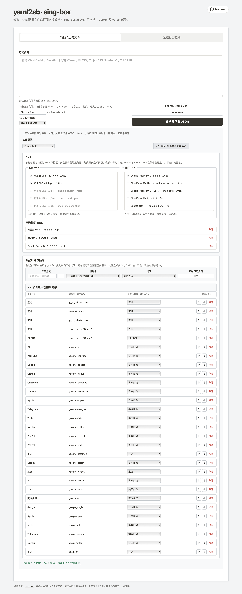

# yaml2sb

将 Clash YAML、Base64 订阅或常见代理 URI 转换为 sing-box JSON。支持多文件 / 多订阅合并、节点名称筛选、保存订阅组合和短链接远程 JSON；提供本地网页版、Docker、Vercel、Cloudflare Workers 与命令行用法。

## 目录

- [支持范围](#支持范围)
- [部署概览](#部署概览)
- [部署到 Vercel](#部署到-vercel)
- [部署到 Cloudflare Workers](#部署到-cloudflare-workers)
- [Docker Compose](#使用-docker-compose-部署)
- [本地启动网页版](#本地启动网页版)
- [HTTP API](#http-api-使用方法)
- [命令行](#本地命令行)
- [网页版与自定义配置](#网页版)
- [注意事项](#注意事项)

## 许可证

本项目采用 [MIT License](LICENSE)。

## 项目 Wiki

请前往 [GitHub Wiki](https://github.com/bacdown/yaml2sb/wiki) 查看使用说明。

## 支持范围

- Clash YAML 中的 `proxies` 节点
- 明文或 Base64 编码的订阅
- URI：`vmess://`、`vless://`、`trojan://`、`ss://`、`hysteria2://` / `hy2://`、`hysteria://`、`tuic://`、`anytls://`
- Clash 节点类型：Shadowsocks（含 obfs / v2ray-plugin / shadow-tls 插件）、VMess、VLESS（含 Reality）、Trojan、Hysteria2、Hysteria v1、TUIC、AnyTLS、HTTP、SOCKS5
- Hysteria2：端口跳跃（`ports` / `mport`）、带宽、`alpn: h3`、`disable_chrome_parrot`（兼容 sing-box 1.14+ Ed25519 证书节点）
- 将解析出的节点并入 sing-box JSON 模板中的策略组

不支持的节点会被跳过；如果没有解析到任何可用节点，转换会报错。

### 近期优化要点

- 修复 Clash `fingerprint` 误当作 uTLS 客户端指纹的问题（证书 SHA256 钉扎不再写入 `tls.utls`）
- Hysteria2 / TUIC 默认补充 `alpn: ["h3"]`，Hysteria2 默认 `disable_chrome_parrot: true`
- Shadowsocks 插件与 HTTP / SOCKS5 / AnyTLS / Hysteria v1 支持
- 协议转换改为注册表结构，便于扩展；增加 `test_convert.py` 单元测试
- 支持 `GET /sub` 远程订阅转换；可部署到 Vercel 与 Cloudflare Workers
- Workers 远程请求使用平台支持的 Fetch 参数格式，并校验每次重定向及订阅大小
- Vercel 与 Workers 共用订阅 URL 校验和参数处理；远程下载失败返回 `502`，内容超限返回 `413`

## 部署概览

选择一种方式即可。各方式的完整步骤只在对应章节维护，避免快速指南与详细说明不一致。

| 方式 | 适用场景 | 详细步骤 |
| --- | --- | --- |
| Vercel | 快速发布公网网页与 API | [部署到 Vercel](#部署到-vercel) |
| Cloudflare Workers | Cloudflare 边缘部署与远程订阅 | [部署到 Cloudflare Workers](#部署到-cloudflare-workers) |
| Docker Compose | 自托管、旁路由或内网部署 | [Docker Compose](#使用-docker-compose-部署) |
| 本机运行 | 本地调试或局域网使用 | [本地启动网页版](#本地启动网页版) |

## 部署到 Vercel

### 通过 Vercel 网站部署



1. 将本项目目录推送到 GitHub 仓库。
2. 登录 [Vercel](https://vercel.com/)，选择 **Add New → Project**，导入该仓库。
3. 确认 **Root Directory** 指向本项目目录。若仓库本身就是本项目，则使用仓库根目录。
4. 保持 Python 项目自动检测设置；如 Vercel 要求选择框架，选择 **Other**。本项目不需要 Build Command 或 Output Directory。
5. 点击 **Deploy**。部署完成后，API 地址为 `https://<项目名>.vercel.app/api`。

部署配置位于 `vercel.json`。三个内置模板位于 `templates/` 目录：`templates/config_phone.json`、`templates/config_openwrt.json` 和 `templates/momo.json`。修改脚本或模板后，推送到已连接的分支即可触发重新部署。

### 通过 Vercel CLI 部署

在项目根目录执行：

```sh
npm install --global vercel
vercel
```

按提示关联或创建项目。正式部署执行：

```sh
vercel --prod
```

### 启用 API Key（可选）

在 Vercel 项目中打开 **Settings → Environment Variables**，添加：

- **Key**：`YAML2SB_API_KEY`
- **Value**：强随机密钥，例如在本机运行 `openssl rand -hex 32` 生成
- **Environment**：选择需要保护的 Production、Preview 和/或 Development 环境

保存后重新部署，使新变量应用到函数运行环境。也可用 Vercel CLI 添加生产环境变量：

```sh
vercel env add YAML2SB_API_KEY production
vercel --prod
```

CLI 会交互式提示输入密钥。不要把密钥写入仓库文件或提交到 Git。

### 启用订阅管理与短链接

Vercel 函数没有持久本地磁盘，短链必须存入 Upstash Redis。短链管理同时要求 Redis 凭据和 `YAML2SB_API_KEY`，只配其中一项不会启用短链管理。

1. 打开 [Vercel Marketplace 的 Upstash for Redis](https://vercel.com/marketplace/upstash)，选择 **Install** / **Add Integration**，授权并选择 yaml2sb 的 Vercel 项目。
2. 在安装流程中选择现有 Upstash 数据库，或新建一个数据库后关联到项目。请确认关联的是实际要使用的 Vercel 项目，而不只是创建了一个未关联的 Redis 数据库。
3. 打开 **Vercel → 项目 → Settings → Environment Variables**，确认存在 `UPSTASH_REDIS_REST_URL` 和 `UPSTASH_REDIS_REST_TOKEN`。两项都必须对 **Production** 生效；若要在 Preview 部署中管理短链，也要勾选 **Preview**。Marketplace 未自动注入变量时，可从 Upstash 数据库的 **REST API** 页面复制 REST URL 和 REST Token，在这里分别新增变量。不要将 token 放进仓库或公开日志。
4. 在同一页面添加 `YAML2SB_API_KEY`，值使用强随机密钥（例如 `openssl rand -hex 32`）。它用于保护创建、列表、修改和删除短链的管理 API；短链读取地址 `/s/<id>` 本身是公开的。
5. 保存后进入 **Deployments**，对目标 Production 分支重新部署。环境变量只会在新部署的函数中生效；Preview 也要单独重新部署对应分支。
6. 按下文“验证短链存储”发送创建请求，再打开响应中的 `short_path`。若创建接口返回 `503`，先检查两个 Upstash 变量的名称、环境范围、值及部署是否已重新执行。

Vercel KV 已停止提供新建服务；新项目请使用 Marketplace 中的 Upstash Redis 集成。不要设置 `YAML2SB_STORE=sqlite` 来绕过 Redis：Vercel 函数的本地文件系统不是持久存储。

## 部署到 Cloudflare Workers

本项目提供 Python Workers 入口（`worker.py`），在 Cloudflare 边缘提供与 Vercel 相同的能力：完整网页 UI、`GET /sub` 远程订阅、`POST /api`（内置模板与自定义 `template_json`）。

### 环境要求

- 已安装 [Node.js](https://nodejs.org/)（供 wrangler 使用）
- 已安装 [uv](https://github.com/astral-sh/uv)
- Cloudflare 账号

### 部署步骤

在项目根目录执行：

```sh
# Worker SDK 要求 Python 3.11+；添加环境标记，保留项目本身对 Python 3.9+ 的支持
uv add --dev \
  "workers-py; python_version >= '3.11'" \
  "workers-runtime-sdk; python_version >= '3.11'"

# 使用 Python 3.11+ 安装开发依赖并运行 Worker 工具
uv sync --group dev --python 3.11

# 登录 Cloudflare（首次）
uv run --python 3.11 pywrangler login

# 本地预览
uv run --python 3.11 pywrangler dev

# 部署到 Workers
uv run --python 3.11 pywrangler deploy
```

注意：`uv add --dev` 会修改 Git 跟踪的 `pyproject.toml` 和 `uv.lock`，并非只安装到本机环境。执行后检查这两个文件的差异，再决定是否保留。Worker 工具应留在开发依赖组，不要移入项目运行依赖；Python 版本标记可避免它们阻止 Python 3.9/3.10 环境解析项目的其他依赖。运行 Cloudflare Worker 命令时使用 Python 3.11 或更高版本。

部署成功后地址形如：

```text
https://yaml2sb.<你的子域>.workers.dev
```

### 部署后验证

先查看 Workers API 是否可访问：

```sh
WORKER_URL='https://yaml2sb.<你的子域>.workers.dev'
curl -fsS "$WORKER_URL/api" | python3 -m json.tool
```

再用一条有效的订阅链接验证远程转换。`curl --get --data-urlencode` 会自动编码原订阅 URL：

```sh
WORKER_URL='https://yaml2sb.<你的子域>.workers.dev'
SUBSCRIPTION_URL='https://example.com/subscribe' # 替换为服务商提供的真实订阅地址
curl --get --fail-with-body \
  --data-urlencode "url=$SUBSCRIPTION_URL" \
  --data-urlencode 'template=phone' \
  "$WORKER_URL/sub" \
  -o sing-box.json
python3 -m json.tool sing-box.json > /dev/null
```

启用 API Key 后，上述 `/api` 和 `/sub` 请求都需要认证。推荐使用请求头：

```sh
curl -H "Authorization: Bearer $YAML2SB_API_KEY" "$WORKER_URL/api"
```

成功时 `/sub` 返回可直接导入客户端的纯 sing-box JSON。测试时请使用有效订阅地址；不要把包含凭据的真实订阅链接提交到仓库或 issue。

### 可选：启用 API Key

在项目根目录运行以下命令，并按提示输入密钥：

```sh
uv run --python 3.11 pywrangler secret put YAML2SB_API_KEY
```

也可在 Cloudflare Dashboard 打开 **Workers & Pages → yaml2sb → Settings → Variables and Secrets**，新增名为 `YAML2SB_API_KEY` 的 **Secret**。保存 Secret 后重新部署 Worker。

`wrangler` 是 Node.js 工具，本项目通过 `pywrangler` 调用它；不要直接运行 `uv run wrangler`。密钥使用方法见下文“API Key 使用方法”。

### 启用订阅管理与短链接

短链管理需要 Workers KV namespace，且 Worker binding 名称必须精确为 `SUBSCRIPTIONS`。只创建 namespace 不会自动绑定到 Worker；本仓库的 `wrangler.toml` 默认没有填写账号专属的 namespace ID，因此需要完成下面的创建、配置和部署步骤。

推荐用 Wrangler 管理绑定，确保后续从命令行部署时配置仍然存在。在项目根目录创建生产 namespace：

```sh
npx wrangler kv namespace create yaml2sb-subscriptions
```

命令输出中会包含 namespace ID。将以下配置追加到项目根目录的 `wrangler.toml`，并把占位值替换为真实 ID：

```toml
[[kv_namespaces]]
binding = "SUBSCRIPTIONS"
id = "<上一步返回的 namespace ID>"
```

保存配置后，设置管理 API 密钥并重新部署：

```sh
uv run --python 3.11 pywrangler secret put YAML2SB_API_KEY
uv run --python 3.11 pywrangler deploy
```

`secret put` 会交互式提示输入密钥。若已经设置过密钥，无需重复设置；修改 namespace 配置后仍要重新部署。

如果需要隔离 Preview / 本地开发数据，另建一个 namespace：

```sh
npx wrangler kv namespace create yaml2sb-subscriptions-preview
```

将返回的另一个 ID 作为 `preview_id` 加入同一个 binding 配置：

```toml
[[kv_namespaces]]
binding = "SUBSCRIPTIONS"
id = "<生产 namespace ID>"
preview_id = "<预览 namespace ID>"
```

生产和预览建议使用不同 namespace，避免测试数据写入生产短链存储。若改用 Cloudflare Dashboard 配置，打开 **Workers & Pages → yaml2sb → Settings → Bindings → Add binding**，选择 **KV namespace**，将 **Variable name** 填为 `SUBSCRIPTIONS`，再选中已创建的 namespace，保存并部署。之后若改用 Wrangler 部署，也要把该绑定及 namespace ID 写入 `wrangler.toml`，并以实际部署使用的配置为准。

短地址 `/s/<id>` 可公开访问，新增、编辑、删除和列表管理接口受 `YAML2SB_API_KEY` 保护。只使用 `/sub?url=...` 直链转换时无需创建 KV namespace 或 API Key。

### 客户端远程配置示例

```text
https://yaml2sb.<你的子域>.workers.dev/sub?url=<URL编码后的原订阅>&template=phone
```

| template | 适用场景 |
|----------|----------|
| `phone`（默认） | 手机 / SFA / SFI 等 |
| `openwrt` | OpenWrt / 旁路由 |
| `momo` | Momo |

配置文件：`wrangler.toml`（入口 `worker.py`）。Worker 入口与转换逻辑位于项目根目录；模板统一读取 `templates/`，网页统一读取 `public/index.html`。Vercel、本地 Web 和 Workers 共用这些资源。

## API Key 使用方法

Vercel、Cloudflare Workers、本地网页版和 Docker Compose 都使用环境变量 `YAML2SB_API_KEY`。未设置或值为空时，API 不要求密钥，服务保持公开访问；设置后，受保护的 API 路由需要有效密钥。首页仍可公开打开。

受保护路由包括 `GET /api`、`POST /api`、`GET /api/options`、`GET /sub`、`GET /api/sub` 和 `/api/subscriptions` 管理接口；本地网页版和 Docker 另有 `POST /fetch`。公开短地址 `GET /s/<id>` 不要求 API Key。密钥支持以下三种方式，优先使用请求头：

- `Authorization: Bearer <密钥>`（推荐）
- `X-API-Key: <密钥>`
- 查询参数 `api_key=<密钥>`（仅在客户端无法添加请求头时使用）

### 网页表单

打开部署首页，在“API 访问密钥”输入框填写服务端配置的密钥，再执行转换或刷新基础配置选项。网页会自动以 `Authorization: Bearer` 请求头发送密钥；密钥不会保存在浏览器中。未启用服务端密钥时无需填写。

### curl 调用 API

先设置部署地址和密钥环境变量：

```sh
BASE_URL='https://<项目名>.vercel.app' # Cloudflare Workers 替换为对应 workers.dev 地址
export YAML2SB_API_KEY='部署时设置的同一个密钥'
```

Bearer Header 示例；`X-API-Key` 可替换为 `-H "X-API-Key: $YAML2SB_API_KEY"`：

```sh
curl -H "Authorization: Bearer $YAML2SB_API_KEY" "$BASE_URL/api"
curl -H "Authorization: Bearer $YAML2SB_API_KEY" \
  "$BASE_URL/api/options?template=config_phone.json"
curl -X POST "$BASE_URL/api" \
  -H "Authorization: Bearer $YAML2SB_API_KEY" \
  -H 'Content-Type: application/json' \
  --data-binary @request.json
```

`request.json` 可以提交 `content`（YAML/URI/订阅正文），也可以提交 `url` 或 `urls` 让服务端拉取远程订阅。JSON 请求体中的订阅链接可原样保留 `&` 等查询参数。

### curl 远程订阅

`GET /sub` 返回可供客户端导入的纯 sing-box JSON。通过 `--data-urlencode` 同时编码原订阅链接和其他查询参数，避免订阅 URL 中的 `&token=...` 被误解析成 API 参数：

```sh
SUBSCRIPTION_URL='https://example.com/subscribe?user=abc&token=xyz'
curl --get --fail-with-body \
  -H "Authorization: Bearer $YAML2SB_API_KEY" \
  --data-urlencode "url=$SUBSCRIPTION_URL" \
  --data-urlencode 'template=phone' \
  "$BASE_URL/sub" \
  -o sing-box.json
```

若客户端支持自定义请求头，设置 `Authorization: Bearer <密钥>` 或 `X-API-Key: <密钥>`。若客户端**不支持请求头**，可将 `api_key=<URL编码后的密钥>` 放入转换服务 URL，例如：

```text
https://<项目域名>/sub?url=<URL编码后的原订阅>&template=phone&api_key=<URL编码后的密钥>
```

查询参数认证会使密钥暴露在 URL、客户端历史记录及可能的访问日志中；只在客户端不支持请求头时使用，不要公开分享包含密钥的完整 URL。订阅原地址也必须整体 URL 编码。

部署后：

| 地址 | 说明 |
|------|------|
| `https://<worker>/` | 网页转换界面（选平台模板 / 上传自定义模板） |
| `https://<worker>/sub?url=...&template=phone` | 客户端远程配置 |
| `https://<worker>/api` | API 说明（JSON） |

## HTTP API 使用方法

### 查看 API 和模板

```sh
curl https://<项目名>.vercel.app/api
```

返回 API 信息、内置模板列表、短名别名，以及 `GET /sub` 订阅转换说明。

### 模板与平台对应关系

| 用途 | 短名（推荐写在 URL 里） | 模板文件 |
|------|-------------------------|----------|
| 手机 / 官方客户端（SFA、SFI 等） | `phone` | `config_phone.json` |
| OpenWrt / 旁路由 | `openwrt` | `config_openwrt.json` |
| Momo | `momo` | `momo.json` |

`template` 参数可写短名或完整文件名；省略时默认 `phone`。

### 远程订阅转换（GET /sub）——客户端直接使用

把**原订阅链接**交给已部署的本项目，在线转换成 sing-box JSON。返回体是**纯配置 JSON**（不是 `{config, node_count}` 包装），可直接作为客户端的远程配置 / 订阅地址。

**链接格式：**

```text
https://<项目名>.vercel.app/sub?url=<URL编码后的原订阅>&template=<phone|openwrt|momo>
```

也支持 `/api/sub`（与 `/sub` 等价；Vercel 上 `/sub` 会重写到 `/api/sub`）。

| 参数 | 必填 | 说明 |
|------|------|------|
| `url` | 是 | 原订阅 HTTP(S) 链接；可出现多次 |
| `urls` | 否 | 多个链接，逗号分隔 |
| `template` | 否 | `phone` / `openwrt` / `momo`（默认 `phone`） |
| `api_key` | 视配置 | 若设置了环境变量 `YAML2SB_API_KEY` 则必填 |

**示例：**

```sh
# 手机模板（默认）
curl -o sing-box.json \
  'https://<项目名>.vercel.app/sub?url=https%3A%2F%2Fexample.com%2Fsubscribe&template=phone'

# OpenWrt 模板
curl -o sing-box-openwrt.json \
  'https://<项目名>.vercel.app/sub?url=https%3A%2F%2Fexample.com%2Fsubscribe&template=openwrt'

# Momo 模板
curl -o sing-box-momo.json \
  'https://<项目名>.vercel.app/sub?url=https%3A%2F%2Fexample.com%2Fsubscribe&template=momo'
```

**在 sing-box 客户端里使用：**

1. 将上面的完整 URL（含 `url` 与 `template`）复制。
2. 在 SFA / SFI / Hiddify / NekoBox 等中添加**远程配置**或**订阅**，粘贴该链接。
3. 客户端定时请求该地址，即可自动拿到转换后的 sing-box JSON。

注意：原订阅地址必须整体做 **URL 编码**。启用 API Key 后，客户端需要按“API Key 使用方法”一节携带密钥。

### 保存订阅组合与短链接

在网页输入多条订阅链接或选择多份 YAML/TXT 文件，填写组合名称和可选的节点筛选条件，点击“保存并生成短链接”。每次访问短链接都会重新拉取远程来源并返回纯 sing-box JSON；单条来源更新后无需重新生成短链接。名称筛选忽略大小写，包含词按任一命中保留，排除词优先。

管理接口必须配置 `YAML2SB_API_KEY`，并按部署方式配置持久存储：Docker Compose 使用自动创建的 SQLite 命名卷；Vercel 使用 `UPSTASH_REDIS_REST_URL` 和 `UPSTASH_REDIS_REST_TOKEN`；Cloudflare Workers 绑定 KV namespace `SUBSCRIPTIONS`。未配置持久存储时管理接口会返回 `503`，不会创建易失短链接。

| 运行方式 | 短链接数据存储 | 设置方法 |
| --- | --- | --- |
| 本机运行 / 自建 Web | SQLite，默认 `data/subscriptions.sqlite3` | 确保该目录位于持久、可写磁盘；可通过 `YAML2SB_DB_PATH` 指定其他 SQLite 文件路径 |
| Docker Compose | SQLite 命名卷 `yaml2sb-data` | Compose 已自动挂载到 `/data/subscriptions.sqlite3`；重建容器会保留数据，删除命名卷则会清空 |
| Vercel | Upstash Redis | 通过 [Vercel Marketplace](https://vercel.com/marketplace/upstash) 创建或关联数据库；详见[Vercel 部署说明](#部署到-vercel) |
| Cloudflare Workers | Workers KV | 创建 namespace 并绑定为 `SUBSCRIPTIONS`；详见[Cloudflare Workers 部署说明](#部署到-cloudflare-workers) |

以上四种方式都还需要配置 `YAML2SB_API_KEY` 才能管理订阅。`/s/<id>` 是公开读取地址，不需要 API Key。若只使用 `/sub?url=...` 远程转换直链，则不保存组合配置，也不需要 Redis、KV 或 SQLite。Docker 部署细节见 [Docker Compose](#使用-docker-compose-部署)，云平台请按各自部署章节绑定对应存储。

#### 验证短链存储

先设置部署地址和管理密钥。Vercel 使用 Production 域名；Workers 使用 `workers.dev` 或自定义域名：

```sh
BASE_URL='https://<你的部署域名>'
export YAML2SB_API_KEY='<部署时设置的同一个密钥>'
```

用一个内嵌的测试 SOCKS5 节点创建短链，不需要真实订阅服务：

```sh
CREATE_RESPONSE=$(curl --fail-with-body -sS -X POST "$BASE_URL/api/subscriptions" \
  -H "Authorization: Bearer $YAML2SB_API_KEY" \
  -H 'Content-Type: application/json' \
  --data-binary '{"name":"storage-smoke-test","contents":["proxies:\n  - name: storage-smoke-test\n    type: socks5\n    server: 127.0.0.1\n    port: 1080\n"],"template":"phone"}')
printf '%s\n' "$CREATE_RESPONSE"
SHORT_PATH=$(printf '%s' "$CREATE_RESPONSE" | python3 -c 'import json,sys; print(json.load(sys.stdin)["short_path"])')
curl --fail-with-body -sS "$BASE_URL$SHORT_PATH" | python3 -c 'import json,sys; config=json.load(sys.stdin); tags=[item.get("tag") for item in config.get("outbounds", [])]; assert "storage-smoke-test" in tags, tags; print("short link OK:", ", ".join(tags))'
```

创建成功应返回 `201` 和形如 `/s/<id>` 的 `short_path`；读取短链应返回 sing-box JSON，且包含 `storage-smoke-test` 节点。这个短链公开可读；验证后可在网页的订阅管理页删除测试记录，或通过带认证的 `DELETE /api/subscriptions/<id>` 删除。

也可以通过 API 删除这条测试记录：

```sh
PROFILE_ID=${SHORT_PATH#/s/}
curl --fail-with-body -sS -X DELETE "$BASE_URL/api/subscriptions/$PROFILE_ID" \
  -H "Authorization: Bearer $YAML2SB_API_KEY"
```

常见故障判断：

| 现象 | 优先检查 |
| --- | --- |
| 创建接口 `401 Unauthorized` | 请求密钥是否与部署环境的 `YAML2SB_API_KEY` 一致；Preview 和 Production 的密钥可能不同 |
| Vercel 创建接口 `503`，提示配置 Upstash | `UPSTASH_REDIS_REST_URL` 与 `UPSTASH_REDIS_REST_TOKEN` 是否都存在、选中了当前部署环境，并在添加/修改变量后重新部署 |
| Workers 创建接口 `503`，提示缺少 `SUBSCRIPTIONS` | namespace 是否已在 `wrangler.toml` 中绑定，binding 名称是否完全一致，部署是否在配置更新后重新执行 |
| 创建返回成功，但 `/s/<id>` 返回 `404` | 访问的域名/部署环境是否与创建时相同；Vercel Preview、Production 及 Workers 的不同 namespace 数据互不共享 |
| `/s/<id>` 返回 `400` | 保存的 YAML / URI 内容无效，或节点筛选后没有匹配项 |
| `/s/<id>` 返回 `502` | 配置保存的是远程订阅 URL，检查来源地址当前是否可访问 |
| `/s/<id>` 返回 `503` | 检查 Vercel Upstash 凭据或 Workers `SUBSCRIPTIONS` binding；也确认当前域名对应的部署环境已经配置存储 |
| `/s/<id>` 返回 `500` | 检查平台函数日志，通常是未预期的存储或转换异常 |

管理路由：`GET /api/subscriptions` 列表、`POST /api/subscriptions` 新建、`GET /api/subscriptions/<id>` 读取详情、`PATCH /api/subscriptions/<id>` 修改、`DELETE /api/subscriptions/<id>` 删除。公开客户端地址为 `GET /s/<id>`，返回可远程加载的 sing-box JSON，不需要管理密钥。

创建请求示例：

```json
{
  "name": "手机日常线路",
  "urls": [
    "https://provider-a.example/sub?token=...",
    "https://provider-b.example/sub?token=..."
  ],
  "template": "phone",
  "node_filter": {
    "include_names": ["JP", "HK"],
    "exclude_names": ["过期"]
  }
}
```

远程订阅 URL 或内嵌 YAML 都保存在配置存储中；其中可能含服务商凭据或节点密码。请保护 API Key、数据库/Redis/KV 访问权限，并避免公开分享来源详情。

### 使用内置模板转换（POST）

向 `POST /api` 发送 JSON。`content` 必须是实际的 YAML 或订阅文本；也可传 `url` / `urls` 由服务端代拉订阅。`template` 可省略（默认手机模板），短名与上表相同。

```sh
curl -X POST 'https://<项目名>.vercel.app/api' \
  -H 'Content-Type: application/json' \
  --data-binary @request.json
```

`request.json` 示例：

```json
{
  "content": "proxies:\n  - name: Japan 01\n    type: vless\n    server: example.com\n    port: 443\n    uuid: 00000000-0000-0000-0000-000000000000\n    tls: true",
  "template": "config_phone.json"
}
```

成功时返回：

```json
{
  "config": {
    "outbounds": []
  },
  "node_count": 1
}
```

### 使用自定义模板

在请求中提供 `template_json`，值可以是 JSON 对象或 JSON 字符串。模板必须是对象，并至少包含数组类型的 `outbounds`。已有 `template` 和 `template_json` 不可同时提供。

```json
{
  "content": "proxies:\n  - name: Japan 01\n    type: vless\n    server: example.com\n    port: 443\n    uuid: 00000000-0000-0000-0000-000000000000\n    tls: true",
  "template_json": {
    "outbounds": [
      {
        "type": "selector",
        "tag": "手动选择",
        "outbounds": []
      }
    ]
  }
}
```

转换时会保留模板配置并追加节点。模板中的策略组若要引用新节点，需使用脚本支持的组名（例如 `手动选择`、`自动选择` 和地区策略组）；其他模板可只提供 `outbounds`，由客户端按需调整策略组。

### 使用自定义制作配置

网页选择 **自定义制作配置** 后，可从 iPhone、OpenWrt 或 Momo 配置开始制作。界面采用横向表单布局；未开放的配置部分保持所选基础配置默认值。国内和国际 DNS 均可直接点击选中或取消，每类最多选择两项；提供阿里云、腾讯 DNSPod、114DNS、Cloudflare、Google Public DNS、Quad9 等主流公共 DNS 及 DoH、DoT、DoQ、DoH3、UDP 等类型，也可直接点击添加自定义 DNS。已选择的 DNS 会显示在下方，可逐项移除；配置中的本地、Hosts 和 FakeIP DNS 作为内部依赖保留，不单独提供选择。

应用分流和规则集都在“匹配规则与顺序”中选择：名称对应具体应用分流，初始出站可选地区、手动/自动组或直连；自定义应用名称会生成对应的 selector 组，所选出站作为该应用组的默认首选。规则集链接可在同一区域展开添加，名称和链接均可自定义，并选择 sing-box `binary` 或 `source` 格式。创建规则的表单与规则列表采用统一的字体和控件样式，添加后可上下移动或删除；未改动的模板默认出站保持原样。

#### 默认匹配规则及顺序建议

基础配置中的这些规则处理的是不同类型的流量：

| 规则 | 意义 |
| --- | --- |
| `{"ip_is_private": true, "outbound": "直连"}` | 目标 IP 属于内网/私有地址时走直连，常用于访问局域网设备和本地服务。 |
| `{"network": "icmp", "action": "resolve"}` | 匹配 ICMP 流量并执行解析动作；它本身不指定出站，不等同于“直连”。 |
| `{"network": "icmp", "outbound": "直连"}` | 将匹配到的 ICMP 流量（例如 ping）交给直连接出站。 |
| `{"clash_mode": "Direct", "outbound": "直连"}` | Clash 当前模式为 `Direct` 时，将匹配流量直连。 |
| `{"clash_mode": "Global", "outbound": "GLOBAL"}` | Clash 当前模式为 `Global` 时，将匹配流量交给 `GLOBAL` 出站组，由该组决定具体出口。 |

建议保留基础配置默认顺序：先处理内网地址、协议或其他基础例外，再处理 ICMP 的解析与直连，随后放置 `Direct` / `Global` 模式规则，然后排列应用分流和规则集规则，最后才放通用兜底规则。应用规则越具体越适合放在越前面；模式规则放在应用规则前，才能使 `Direct` / `Global` 模式覆盖常规应用分流。若希望特定应用在 `Global` 模式下仍使用自己的分流，可将该应用规则移到 `Global` 规则之前，但这会改变全局模式下的行为。ICMP 的 `resolve` 应排在 ICMP 直连之前，以免直连规则先结束对该流量的处理。

部分模板（如 iPhone 配置）会出现两条相同的 `ip_is_private: true` 直连规则；两者条件和出站相同，后出现的重复项通常不会增加新的匹配效果。调整顺序时可将其视为同一条规则；如需精简，可移除重复项，但建议先确认没有依赖模板的其他自定义改动。

程序会清理被取消规则集对应的规则和分流组引用；移除 DNS 服务器后，其余配置中指向该服务器的 DNS 引用会改指剩余可用 DNS。地区、手动/自动组和“延迟辅助”会作为出站保留，但不会作为应用名称显示。“延迟辅助”和直连不会出现在规则集的匹配目标出站选择器中；直连可作为自定义应用分流的初始出站，模板中已有的直连规则保持原样。

同一功能也可通过 API 使用。`GET /api/options?template=config_phone.json` 返回对应基础模板可选的 DNS、分流组和规则集；分流组带有 `application` 标识，界面据此将应用组与地区出站区分，`matching_targets` 不包含应用组、直连或“延迟辅助”。配置了 `YAML2SB_API_KEY` 时，读取该接口也需要 API 密钥。转换请求的 `template_options` 可以传入 `dns_servers`、`custom_dns_servers`、`groups`、`custom_groups`、`rule_sets`、`custom_rule_sets`、`custom_matching_rules`、`rule_destinations`、`rule_order` 和 `rule_outbounds`。`custom_groups` 可通过 `rule_sets` 将规则集加入应用分流组；`custom_matching_rules` 可按名称、规则集和初始出站新增应用分流及匹配规则；`rule_order` 使用 `/api/options` 返回的匹配规则索引字符串，以及新增规则集对应的 `custom:<tag>` 或自定义匹配规则的 `builder-<序号>` 排列。`custom_dns_servers` 中的 DNS 对象按 sing-box DNS server 字段传入，例如 `{"tag":"doh","type":"https","server":"dns.example","server_port":443,"path":"/dns-query"}`。未提供 DNS 选择时，使用基础模板默认 DNS；被取消的内部 DNS 依赖仍会保留。

```json
{
  "content": "proxies:\n  - name: Japan 01\n    type: vless\n    server: example.com\n    port: 443\n    uuid: 00000000-0000-0000-0000-000000000000\n    tls: true",
  "template": "config_phone.json",
  "template_options": {
    "custom_dns_servers": [
      {"tag": "custom-dns", "type": "https", "server": "1.1.1.1"}
    ],
    "custom_groups": [
      {"tag": "Games", "rule_sets": ["geosite-youtube"]}
    ],
    "custom_rule_sets": [
      {
        "tag": "geosite-games",
        "url": "https://example.com/games.srs",
        "format": "binary",
        "outbound": "Games"
      }
    ]
  }
}
```

### 请求与错误

- 请求体最大为 **2 MiB**。
- `400`：JSON 格式错误、缺少 `content`、订阅 URL 无效、模板名称不支持或模板格式无效。
- `413`：请求体或单条远程订阅内容超过 **2 MiB**。
- `502`：远程订阅服务器不可访问、返回非成功状态或响应无效。
- `500`：转换期间发生未预期错误。
- 远程订阅只允许公网 HTTP(S) 地址；`GET /sub` 每次最多 **10 条**，且每个重定向目标都会重新校验。
- `POST /api` 可直接传订阅正文（`content`），也可传 `url` / `urls` 由服务端代为下载后转换。`GET /sub` 专供客户端远程配置，返回纯 sing-box JSON。

## 本地命令行

需要 Python 3.9 或更高版本。安装依赖：

```sh
python3 -m pip install .
```

直接运行脚本会启动交互式菜单，可逐行输入订阅链接或文件路径、选择模板并指定输出位置：

```sh
python3 sub2singbox.py
```

也可以显式启动菜单：

```sh
python3 sub2singbox.py --interactive
```

转换远程订阅链接（模板文件位于 `templates/` 目录）：

```sh
python3 sub2singbox.py 'https://example.com/subscribe' \
  -c templates/config_phone.json \
  -o sing-box.json
```

转换本地文件：

```sh
python3 sub2singbox.py ./subscription.yaml \
  -c templates/config_openwrt.json \
  -o ./sing-box-openwrt.json
```

也可以一次传入多个链接或文件；使用非交互命令行参数时，`-c/--config` 模板参数必填，`-o/--output` 可选。不指定输出路径时，输出到第一个本地输入文件所在目录；如果输入全是链接，则输出到当前目录。

如果远程地址下载成功但内容无法识别，程序会显示响应的 `Content-Type` 和字节数，不会打印响应正文或 URL 中的凭据。请确认使用的是服务商提供的 Clash/Mihomo 订阅地址，而非管理页面或登录链接；也可在服务商处导出订阅文件后作为本地文件转换。

## 注意事项

- 订阅链接通常包含私密凭据。不要将真实订阅链接、节点密码、UUID 或完整配置提交到公开仓库，也不要在公开 issue 或日志中粘贴。
- API Key 可按部署方式启用；网页、curl、请求头和客户端远程订阅的完整配置方法见“API Key 使用方法”。未设置密钥时接口保持公开。该密钥是简单的共享令牌，不提供用户身份、配额或速率限制；公网服务需要更强访问控制时，可在前面增加 Cloudflare Access 或反向代理。
- 自定义模板通过请求提交；内置模板通过文件名白名单选择，不允许传入任意文件路径。
- 转换结果会携带订阅中的节点认证信息。请妥善保存响应内容，避免公开分享。
- 输出是转换后的 sing-box 配置，不代表配置一定符合所有 sing-box 版本或运行环境的要求；部署/导入前请使用目标 sing-box 版本验证。

## 网页版

网页版支持两种输入方式：

1. 粘贴订阅内容，或一次选择多个本地 YAML / TXT 文件，每份文件会分别解析后合并转换。
2. 输入一条或多条远程 HTTP(S) 订阅链接（每行一条），由服务端下载并合并转换。

两种方式都可以选择手机、OpenWrt 或 Momo 内置模板（文件整理在 `templates/` 目录），也可以上传自定义 sing-box JSON 模板；页面会检查 JSON 根节点及 `outbounds` 必要项，通过校验后才允许转换。下载结果为转换后的 sing-box JSON。远程下载仅允许公网 HTTP(S) 地址，单次下载最大 2 MiB，并会检查重定向目标。Vercel 部署时首页由 `public/index.html` 提供，页面输入（含远程链接）统一提交至 `/api`。

要生成 sing-box 可远程使用的订阅地址，切换到“远程订阅链接”输入方式，每行填写一条上游订阅 URL，选择内置模板，然后点击“生成远程订阅链接”并复制结果到客户端的远程配置 / 订阅入口。生成的地址指向当前部署域名下的 `/sub`，不需要 Redis、KV 等持久化存储；客户端每次拉取时，服务端会重新下载上游订阅并转换。直链目前仅支持内置模板，且不能应用节点名称筛选；需要筛选、自定义模板，或从粘贴内容生成稳定地址时，请使用下方的“保存并生成短链接”，该功能需要配置 API Key 和持久化存储。

若填写了 API Key，生成的直链会把密钥放入 `api_key` 查询参数，以便不支持自定义请求头的客户端访问。完整 URL 会包含密钥，请勿公开分享；查询参数认证也可能出现在客户端历史记录或服务端访问日志中。

可填写节点名称包含/排除关键词（每行一项，忽略大小写）；包含条件按“任一匹配”处理，排除条件优先。填写组合名称后可保存当前来源、模板和筛选条件，生成稳定的 `/s/<id>` 短链接。客户端访问短链接时会重新拉取来源并输出纯 sing-box JSON。管理界面支持查看、编辑和删除保存项。

### sing-box 客户端无延迟排查

当前 Hysteria2 转换会输出 `disable_chrome_parrot`，该字段要求 sing-box 1.14.0 或更高版本。低于该版本的客户端可能无法加载整个配置，而不只是 HY2 节点；升级客户端后重新更新远程配置。若当前版本已满足要求但所有节点仍无延迟，先查看客户端日志中是否有配置解析错误，并确认远程配置响应是纯 sing-box JSON、节点已实际加载；随后用同版本 sing-box 执行 `sing-box check -c sing-box.json` 检查配置。若只有个别节点测速失败，再检查该节点的 TLS/SNI、证书校验、端口和协议参数。

### 使用 Docker Compose 部署

默认不启用 API Key。需要启用时，在项目目录生成并导出一个强随机密钥，再启动 Compose：

```sh
export YAML2SB_API_KEY="$(openssl rand -hex 32)"
docker compose up --build -d
```

Compose 会将该变量传入容器。后续重建或更新容器时，也要在当前 shell 中设置同一个值；否则新容器会按未设置密钥的公开模式运行。不要把密钥提交到仓库。

Compose 会把 SQLite 订阅库写入命名卷 `yaml2sb-data`，容器重建后数据保留。启用订阅管理时必须配置 `YAML2SB_API_KEY`。

未启用密钥时，直接在项目目录运行：

```sh
docker compose up --build -d
```

打开 <http://localhost:8080> 使用网页。可通过 `YAML2SB_PORT` 修改宿主机映射端口，例如：

```sh
YAML2SB_PORT=9090 docker compose up --build -d
```

部署后可用以下命令检查首页、API 和模板选项接口是否返回 HTTP 200：

```sh
curl --fail --silent --show-error -o /dev/null -w '首页 HTTP %{http_code}\n' http://localhost:8080/
curl --fail --silent --show-error -o /dev/null -w 'API HTTP %{http_code}\n' http://localhost:8080/api
curl --fail --silent --show-error -o /dev/null -w '模板选项 HTTP %{http_code}\n' \
  'http://localhost:8080/api/options?template=config_phone.json'
```

如果通过 `YAML2SB_PORT` 使用了其他宿主机端口，请相应替换命令中的 `8080`。启用了 API 密钥时，为后两条命令添加 `-H "Authorization: Bearer $YAML2SB_API_KEY"`。

查看日志和停止服务：

```sh
docker compose logs -f
docker compose down
```

也可以直接构建并运行 Docker 镜像：

```sh
docker build -t yaml2sb .
docker run --rm -p 8080:8080 \
  -e YAML2SB_API_KEY="$YAML2SB_API_KEY" \
  -v yaml2sb-data:/data \
  yaml2sb
```

### 本地启动网页版

安装项目依赖后运行：

```sh
python3 web_server.py
```

默认仅监听本机 `127.0.0.1:8080`。如需从局域网其他设备访问，可显式监听所有网卡：

```sh
python3 web_server.py --host 0.0.0.0 --port 8080
```

默认未启用令牌认证。若需启用，可在启动进程前设置 `YAML2SB_API_KEY`：

```sh
YAML2SB_API_KEY='替换为强随机密钥' python3 web_server.py
```

Docker Compose 会把当前 shell 中导出的 `YAML2SB_API_KEY` 传给容器；直接运行 Docker 镜像时使用 `-e YAML2SB_API_KEY="$YAML2SB_API_KEY"`。启用后，网页首页仍可打开，在页面的“API 访问密钥”栏输入密钥；调用 API 的客户端使用 `Authorization: Bearer <密钥>` 或 `X-API-Key: <密钥>` 请求头。密钥未设置时仍是公开访问，因此不要直接把未保护的服务暴露到公网；公网部署还应使用 HTTPS、访问控制和适当的用量限制。
